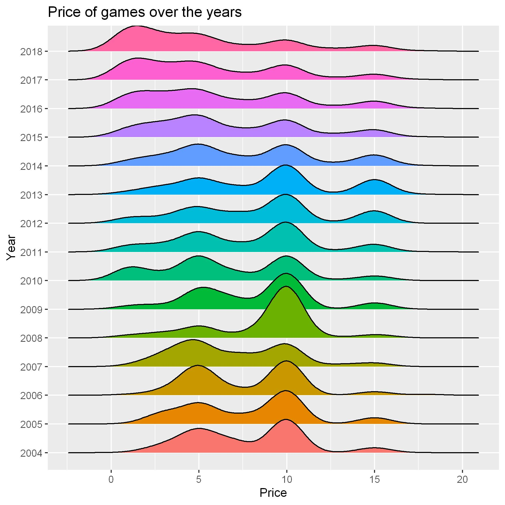

# Video games

Week 31 of tidy tuesday was about video games. The data can be found [here](https://github.com/rfordatascience/tidytuesday/blob/master/README.md).

In this analysis, I look if the game prices have increased or decreased over the years.

Following is the plot:

The density plots seem to shift towards left over the years.
