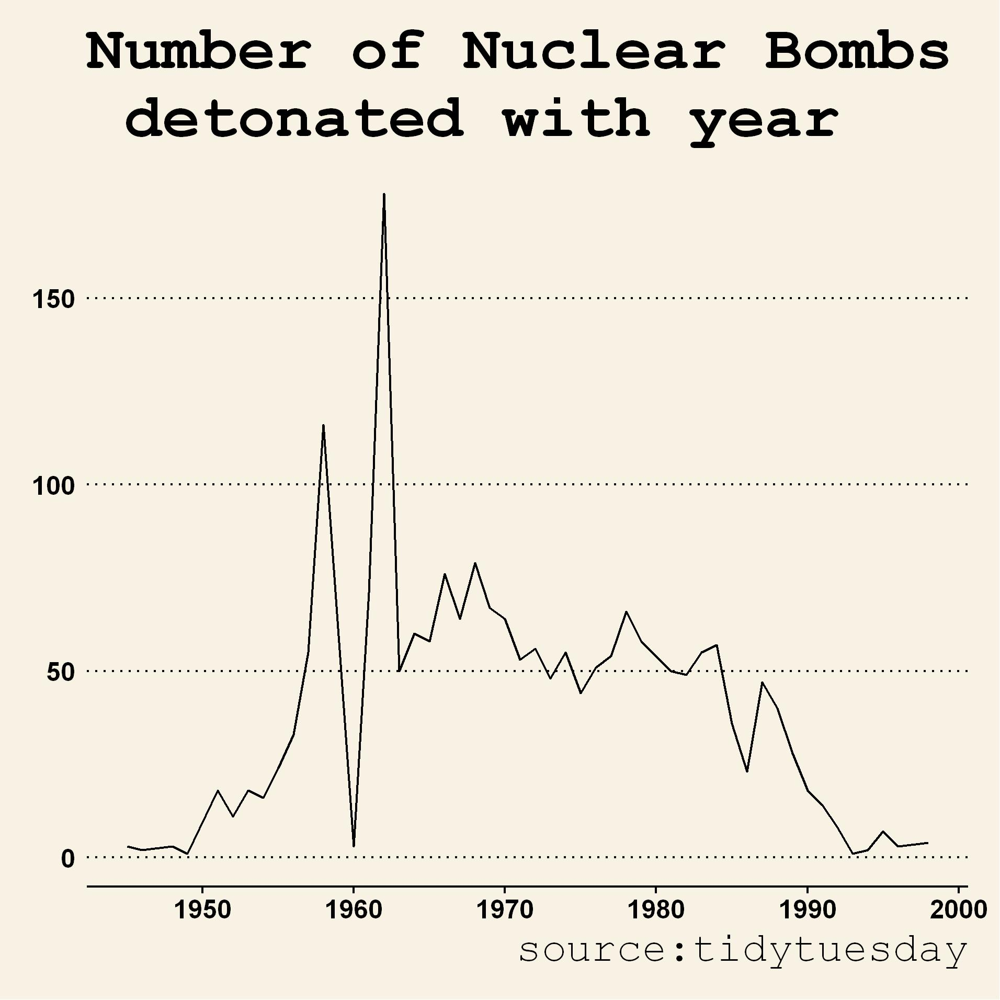
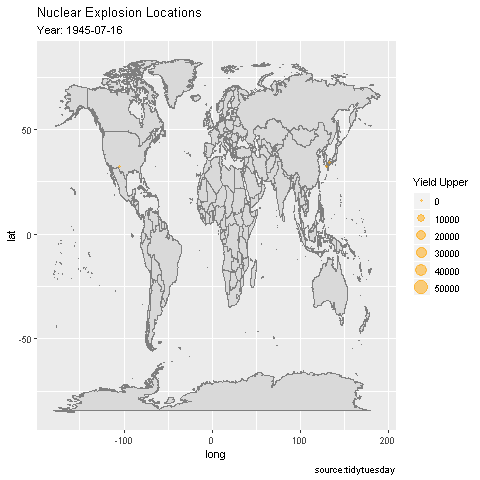

# Nuclear Explosions

Week 34 of Tidy Tuesday had the data of nuclear explosions. The data can be found [here](https://github.com/rfordatascience/tidytuesday/blob/master/README.md).

The number of explosions saw a spike around 1960

The following animated gif plot shows the detonating locations over the years.

